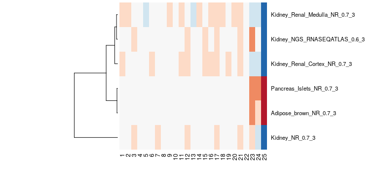

[](https://github.com/Accio/BioQC/actions)
[](https://codecov.io/gh/Accio/BioQC)


BioQC is a is a R/[Bioconductor](https://bioconductor.org/packages/release/bioc/html/BioQC.html) package to detect tissue heterogeneity in gene expression data. 
Tissue heterogeneity is a consequence of unintended profiling of cells of other origins than the tissue of interest and can
have both technical (*e.g.* imperfect disection) or biological (*e.g.* immune infiltration) reasons. 

We [demonstrated](https://www.biorxiv.org/content/10.1101/2020.12.02.407809v1) that tissue heterogeneity is prevalent
in 5-15% of all gene expression studies. Ignoring tissue heterogeneity reduces statistical power of data analysis and can, in the worst case, invalidate the conclusions of a study.
Therefore, we propose applying BioQC as a routine step in every gene-expression analysis pipeline. 

The BioQC method is described in 

> Zhang, Jitao David, Klas Hatje, Gregor Sturm, Clemens Broger, Martin Ebeling, Martine Burtin, Fabiola Terzi, Silvia Ines Pomposiello, and Laura Badi.
> “Detect Tissue Heterogeneity in Gene Expression Data with BioQC.” BMC Genomics 18 (2017): 277. [doi:10.1186/s12864-017-3661-2](https://doi.org/10.1186/s12864-017-3661-2)).


## Basic Usage

BioQC implements a computationally efficient Wilcoxon-Mann-Whitney test for testing
for enrichment of tissue signatures. A database of 150 tissue signatures derived
from large-scale transcriptomics studies is shipped with the BioQC package. 

To apply BioQC to a `genes x samples` gene expression matrix, run:

```R
library(BioQC)

# load the tissue signatures
gmtFile <- system.file("extdata/exp.tissuemark.affy.roche.symbols.gmt",
                        package="BioQC")
gmt <- readGmt(gmtFile)

# perform BioQC enrichment test on a gene expression matrix
bioqc_res = wmwTest(expr_mat, gmt)
bioqc_scores = absLog10p(bioqc_res)
```

The following figure shows the BioQC scores from the [kidney example](https://accio.github.io/BioQC/bioqc.html) 
visualized as heatmap. We note that in samples 23-25 *adipose* and *pancreas* signatures
have been detected, hinting at a containation with those tissues. For this dataset, 
we could validate the contamination with qPCR. 



For a more detailed example explaining how to use other data structures or custom signatures
see
 * [Applying BioQC to a real-world kidney dataset](https://accio.github.io/BioQC/bioqc.html). 
 * [Introduction to BioQC](https://accio.github.io/BioQC/articles/bioqc-introduction.html). 

For advanced usages, check out:
 * [Single sample gene set enrichment analysis with BioQC](https://accio.github.io/BioQC/articles/bioqc-signedGenesets.html)

For benchmarks and details about the algorithm, see: 
 * [BioQC-benchmark: Testing Efficiency, Sensitivity and Specificity of BioQC on simulated and real-world data](https://accio.github.io/BioQC/bioqc-simulation.html)
 * [Comparing the Wilcoxon-Mann-Whitney to alternative statistical tests](https://accio.github.io/BioQC/articles/bioqc-wmw-test-performance.html)
 * [The BioQC algorithm: speeding up the WMW-test](https://accio.github.io/BioQC/articles/bioqc-efficiency.html)


## Installation

### Bioconductor
BioQC is available [from Bioconductor](https://www.bioconductor.org/packages/release/bioc/html/BioQC.html). 

You can install it using 
```R
if (!requireNamespace("BiocManager", quietly = TRUE))
    install.packages("BiocManager")

BiocManager::install("BioQC")
```

### Bioconda
Alternatively, you can use the [conda](https://docs.conda.io/en/latest/miniconda.html) package
manager. 

1. Make sure you [set-up the Bioconda channel correctly](https://bioconda.github.io/user/install.html#set-up-channels). The order of the channels is important!
2. (Optional) Create and activate an environment for BioQC
   
   ```bash
   conda create -n bioqc
   conda activate bioqc
   ```

3. Install the `bioconductor-bioqc` package in your current environment
   
   ```bash
   conda install bioconductor-bioqc
   ```

### From Github

The easiest way to install the development version from GitHub is using the `remotes` package: 

```R
install.packages("remotes")
remotes::install_github("accio/BioQC")
```

## Contact

If you have questions regarding BioQC or want to report a bug, please use the [issue tracker](https://github.com/accio/BioQC/issues). 

Alternatively you can reach out to Jitao David Zhang via [e-mail](jitao_david.zhang@roche.com).
